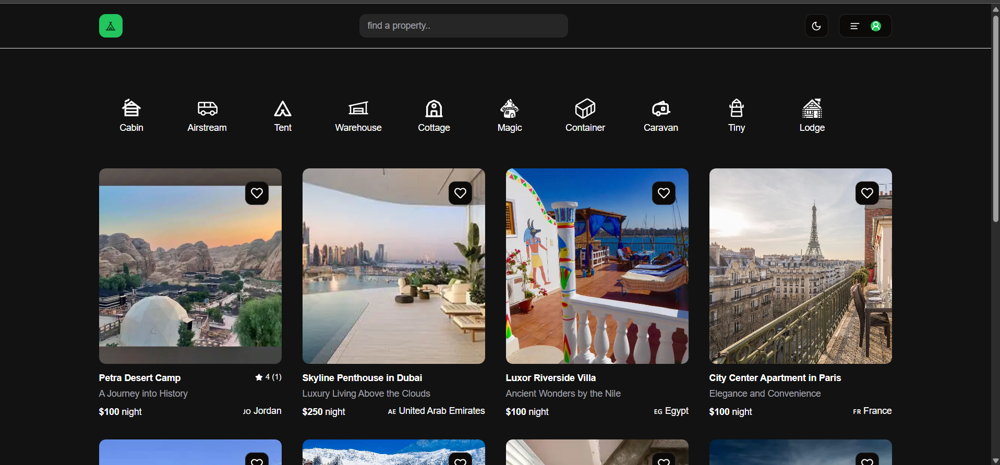

# Travel BNB

Global Reservation Hub is your one-stop travel app for booking any place you wish to visit around the world. Whether it's a serene beach resort, a bustling city hotel, or a quaint countryside inn, our app ensures you find the perfect spot for your stay




Live Demo 
<hr/> 
Explore the app live <a href='https://travel-app-nextjs-theta.vercel.app' target="_blank">Travel BNB</a>

## Table of Contents
- [About The Project](#about-the-project)
- [Features](#features)
- [Technologies Used](#technologies-used)
- [Getting Started](#getting-started)
- [Usage](#usage)
- [Contact](#contact)
- [Acknowledgements](#acknowledgements)

---

## About The Project

Next BnB is an engaging and interactive project designed to help developers build proficiency in web development using Next.js 14. This platform serves as a fully functional vacation rental application, showcasing key concepts in front-end and back-end development.

This project teaches:

- Building a responsive and dynamic user interface with **TailwindCSS** and **Shadcn/UI**.
- Developing structured and maintainable backend logic with **Next.js Server Actions**, **Prisma ORM**, and **Supabase**.
- Understanding the differences between server and client components, fetching data, managing states, and handling nested layouts.
- Implementing robust user authentication and account management with **Clerk**.
- Adding interactivity through CRUD operations and ensuring data validation with the **Zod library**.
- Uploading and managing images with **Supabase storage**.
- Deploying a production-ready application using **Vercel**.

This hands-on project provides practical challenges and solutions, empowering you to create sophisticated web applications confidently.

---

## Features

- **Dynamic Categories**: Explore listings by categories like cabins, airstreams, tents, and more.
- **Shadcn Components**: Beautiful and reusable components powered by Shadcn/UI.
- **Dark Mode**: A fully integrated theme toggle for improved user experience.
- **Authentication**: Secure and seamless login via Clerk.
- **Reviews**: View and interact with user reviews for listings.
- **PostgreSQL Database**: Reliable and fast database integration using Prisma and Supabase.

---

## Technologies Used

- [![Next.js][Next.js]][Next-url]
- [![React][React.js]][React-url]
- [![TailwindCSS][TailwindCSS]][TailwindCSS-url]
- [![Prisma][Prisma]][Prisma-url]
- [![Supabase][Supabase]][Supabase-url]
- [![Clerk][Clerk]][Clerk-url]
- [![Vercel][Vercel]][Vercel-url]

---

## Getting Started

To get a local copy up and running, follow these steps:

### Prerequisites

- Node.js and npm installed
- A PostgreSQL database
- Supabase, Clerk, and Stripe accounts for API keys

### Installation

1. Clone the repo:

   ```bash
   git clone https://github.com/simoncheam/next-bnb.git
   cd next-bnb
   ```

2. Install dependencies:

   ```bash
   npm install
   ```

3. Set up environment variables:
   You need **two separate environment files** for proper configuration:

   #### `.env.local`

   ```env
   # Clerk (Authentication)
   NEXT_PUBLIC_CLERK_PUBLISHABLE_KEY=
   CLERK_SECRET_KEY=
   NEXT_PUBLIC_CLERK_SIGN_IN_FALLBACK_REDIRECT_URL=/profile/create
   NEXT_PUBLIC_CLERK_SIGN_UP_FALLBACK_REDIRECT_URL=/profile/create

   # Website URL
   NEXT_PUBLIC_WEBSITE_URL=https://next-bnb.vercel.app
   ```

   #### `.env`

   ```env
   # Prisma and Database
   DATABASE_URL=
   DIRECT_URL=

   # Supabase
   SUPABASE_URL=
   SUPABASE_KEY=

   # Stripe
   NEXT_PUBLIC_STRIPE_PUBLISHABLE_KEY=
   STRIPE_SECRET_KEY=
   ```

   > **Note**: Ensure these files are created in the root directory of your project and not committed to version control (add them to `.gitignore`).

4. Initialize Prisma:

   ```bash
   npx prisma migrate dev
   ```

5. Start the development server:

   ```bash
   npm run dev
   ```

6. Open your browser at `http://localhost:3000`.

---
